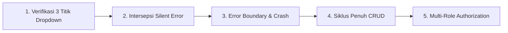

# Standar Baku Audit Fungsional CRUD & E2E Testing

Dokumen ini merupakan **Standar Baku (Directive & Testing Policy)** untuk melakukan audit dan pengujian fungsional interaktif pada seluruh halaman CRUD (Create, Read, Update, Delete) di ekosistem aplikasi.

---

## 1. Filosofi & Tujuan Skill

Audit Fungsional berbeda dengan Audit Statis (Lint/Reviewer):
- **Audit Statis (Code Review)**: Memeriksa apakah penulisan kode mematuhi aturan sintaks, penggunaan komponen UI Kit, ketiadaan hardcode, dan arsitektur file.
- **Audit Fungsional (E2E Testing)**: Menjalankan aplikasi secara nyata di browser untuk memverifikasi apakah halaman dapat beroperasi tanpa error, tombol dapat diklik, data relasi dapat dimuat ke form/dropdown, validasi input berjalan, data berhasil disimpan ke database, dan siklus CRUD lengkap hingga selesai.

---

## 2. Lima Pilar Utama Audit Fungsional CRUD

Setiap pelaksanaan audit fungsional **WAJIB** mencakup lima pilar evaluasi berikut:



---

### PILAR 1: Verifikasi 3 Titik Dropdown (3-Point Dropdown Verification)

Dropdown relasi data (`<Select>` dan `<AsyncSelect>`) adalah titik paling rawan terjadinya bug parsing frontend. Auditor **WAJIB** memeriksa korelasi antara 3 titik:

1. **Titik 1 - Database (DB Existence)**:
   - Periksa apakah tabel master/relasi memiliki data di database (`SELECT count(*) FROM table`).
2. **Titik 2 - Respons API Backend (Network Payload)**:
   - Sadap respons HTTP dari endpoint API:
     - Apakah status HTTP `200 OK` atau error (`500`, `404`, `403`, `422`)?
     - Apakah struktur data berformat paginasi `{ data: { current_page: 1, data: [...] } }` atau array mentah `{ data: [...] }`?
3. **Titik 3 - Rendering UI Dropdown (Component State)**:
   - Picu interaksi pada komponen dropdown (klik atau ketik kata kunci pencarian).
   - Periksa elemen pilihan yang dirender di DOM (`[role="option"]` atau list item).

#### Matriks Diagnosa Status Dropdown:

| Database (DB) | Respons API Backend | Tampilan UI Dropdown | Status Audit | Tindakan & Penjelasan |
| :--- | :--- | :--- | :---: | :--- |
| **Ada Data** (`> 0`) | `200 OK` (berisi data) | **Kosong** (*No options*) | ❌ **BUG PARSING FRONTEND** | **GAGAL FATAL.** Frontend salah mengekstrak array (misal menganggap paginasi sebagai array mentah). Wajib diperbaiki! |
| **Ada Data** (`> 0`) | `500` / `404` / `403` | **Kosong** (*No options*) | ❌ **BUG BACKEND / API** | **GAGAL.** Relasi model putus (`RelationNotFoundException`), query error, atau route/permission belum dikonfigurasi. |
| **Kosong** (`= 0`) | `200 OK` (array `[]`) | **Kosong** (*No options*) | ℹ️ **VALID EMPTY STATE** | **LOLOS (Bukan Bug).** Data referensi di database memang belum pernah dibuat oleh admin. |
| **Ada Data** (`> 0`) | `200 OK` (berisi data) | **Muncul Pilihan Data** | ✅ **HEALTHY / OK** | **LOLOS.** Komponen sukses mengambil, mengurai, dan menampilkan pilihan data. |

> [!CAUTION]
> **Dilarang Keras** menyimpulkan bahwa dropdown kosong adalah "wajar" sebelum memeriksa kondisi data di Database dan payload API Backend!

---

### PILAR 2: Intersepsi Silent Error & Console Log

Banyak komponen frontend menggunakan blok `try ... catch` yang menelan error tanpa memberi tahu user, seperti:
```typescript
try {
  const res = await apiService.getList();
  return res.data.map(...); // Error jika res.data berupa paginated object!
} catch {
  return []; // Silent error: mengembalikan array kosong!
}
```
Auditor **WAJIB**:
- Mendengarkan event `page.on('pageerror')` dan `page.on('console')`.
- Menangkap error seperti:
  - `TypeError: *.map is not a function`
  - `TypeError: Cannot read properties of undefined`
  - `Unhandled Promise Rejection`
- Setiap silent error yang tertangkap di console browser dicatat sebagai **Temuan Kritis (Critical Issue)**.

---

### PILAR 3: Error Boundary & Crash Detection

Auditor **WAJIB** memeriksa apakah halaman mengalami crash parsial maupun total:
1. **Layar Putih / Blank Screen**: DOM `<body>` kosong atau gagal me-mount komponen React.
2. **Next.js Error Boundary**: Terdeteksi elemen teks:
   - *"Terjadi Kesalahan Sistem"*
   - *"Application error: a client-side exception has occurred"*
3. **HTTP 500 Server Error**: Terdeteksi respons API dengan kode `500 Internal Server Error` (misalnya error query SQL, relasi Eloquent yang belum didefinisikan, atau controller crash).

---

### PILAR 4: Siklus Penuh Operasi CRUD

Pengujian fungsional wajib menguji keempat operasi dasar:

1. **CREATE (Tambah Data)**:
   - Buka form tambah data (`/create` atau Modal).
   - Pastikan seluruh input form (`<Input>`, `<Select>`, `<AsyncSelect>`, `<Textarea>`) menerima data.
   - Klik tombol **Simpan / Submit**.
   - Verifikasi bahwa API menerima payload `POST`, mengembalikan status `200` atau `201`, notifikasi toast berhasil muncul, dan record baru tercatat di database.

2. **READ (List & Detail)**:
   - Buka halaman tabel (`<DataTable />`).
   - Verifikasi bahwa data tampil dan kolom tidak bernilai `undefined` / `[object Object]`.
   - Uji paginasi *server-side* (klik nomor halaman atau ubah per_page).
   - Uji buka Filter Drawer kanan-ke-kiri dan verifikasi filtering berfungsi.
   - Buka **Halaman Detail Terpisah** (`/[id]`), pastikan seluruh data relasi (seperti berkas, tab riwayat, rekap data) ter-load lengkap tanpa error.

3. **UPDATE (Ubah Data)**:
   - Buka form edit (`/[id]/edit` atau Modal Edit).
   - Pastikan nilai awal (*initial values*) terisi dengan benar pada setiap field input form.
   - Ubah salah satu nilai field dan lakukan submit `PUT` / `PATCH`.
   - Verifikasi bahwa data di database ter-update sesuai perubahan.

4. **DELETE (Hapus Data)**:
   - Buka tombol aksi titik-3 (`<DropdownMenu />`), klik aksi **Hapus**.
   - Pastikan muncul modal konfirmasi bertema UI (`<ConfirmDialog />`), **DILARANG dialog native browser (`confirm()`)**.
   - Klik tombol konfirmasi hapus, verifikasi API `DELETE` berjalan, dan record terhapus/ter-soft delete dari database.

---

### PILAR 5: Matriks Pengujian Multi-Role (RBAC Check)

Modul di ekosistem kampus melibatkan multi-role. Auditor **WAJIB** menguji skenario otorisasi:

1. **Role Super Admin**:
   - Memiliki kendali penuh pada semua menu, tombol tambah, edit, hapus, dan konfigurasi master.
2. **Role Admin Modul (cth: Admin SIMPEG / Admin Keuangan)**:
   - Mengelola operasional modul, verifikasi permohonan, persetujuan status (*approval*), dan kalkulasi data.
3. **Role Pengguna Akhir (cth: Pegawai / Dosen / Mahasiswa)**:
   - Menguji *Self-Service*: hanya bisa melihat data milik pribadinya (*scoped data*).
   - Tombol-tombol manajerial (hapus data orang lain, persetujuan/approval manajer) **TIDAK BOLEH** tampil di UI dan API **WAJIB** menolak dengan `403 Forbidden` jika diakses langsung.

---

## 3. Prosedur & Cara Eksekusi Audit Fungsional

### Persiapan Lingkungan Uji (Prasyarat):
1. **Server Backend Berjalan**: `php artisan serve --host=127.0.0.1 --port=8000` dalam mode persistent/daemon.
2. **Server Frontend Berjalan**: `npm run dev` pada `http://localhost:3000` dalam mode persistent/daemon.
3. **Pustaka Headless Browser**: Tersedia runtime Node.js dengan Playwright atau Puppeteer di `node_modules`.

### Alur Eksekusi:
1. Buat skrip audit di direktori sementara/scratch (misal: `scratch/audit_functional_<modul>.js`).
2. Masukkan daftar seluruh URL rute halaman yang akan diaudit (List, Create, Detail, Edit, Master).
3. Jalankan skrip via perintah terminal:
   ```bash
   NODE_PATH=./node_modules node <path_to_audit_script>.js
   ```
4. Pantau console browser, respons network API, dan status rendering DOM.
5. Kumpulkan hasil evaluasi dan susun ke dalam Format Laporan Audit Standar.

---

## 4. Standar Format Laporan Hasil Audit

Setiap kali menyelesaikan audit fungsional, auditor **WAJIB** menyajikan laporan dengan struktur berikut:

```markdown
# Laporan Hasil Audit Fungsional CRUD: Modul [NAMA_MODUL]

## 1. Ringkasan Eksekutif
- Total Halaman Diuji: [X] Halaman
- Total Status Berhasil (Healthy): [Y] Halaman
- Total Masalah Ditemukan: [Z] Titik

## 2. Tabel Matriks Pengujian Halaman
| Halaman / Fitur | Rute URL | Form / Dropdown | Respons API | Status | Keterangan |
| :--- | :--- | :---: | :---: | :---: | :--- |
| ... | ... | ... | ... | ✅ / ❌ | ... |

## 3. Rincian Masalah yang Ditemukan (Jika Ada)
### Temuan #1: [Nama Masalah]
- **Lokasi Halaman**: `[URL Rute]`
- **Kategori**: `[Bug Parsing Frontend / Bug Backend / Error Boundary / RBAC]`
- **Gejala**: Dropdown kosong / Halaman crash / Error 500
- **Akar Masalah (Root Cause)**: Penjelasan teknis kode penyebab masalah.
- **Rekomendasi Perbaikan**: Kode solusi yang dianjurkan.

## 4. Kesimpulan & Rekomendasi
Status kelayakan rilis modul (Ready to Deploy / Needs Fixes).
```

---

## 5. Template Helper Skrip Uji (Playwright Reference)

Auditor dapat mengadaptasi pola skrip Playwright berikut untuk menguji dropdown dan mendeteksi silent error:

```javascript
const { chromium } = require('playwright');

async function testDropdown(page, selectSelector, apiEndpointPattern) {
  let apiResponse = null;
  
  // 1. Sadap respons network
  page.on('response', async (res) => {
    if (res.url().includes(apiEndpointPattern) && res.request().method() === 'GET') {
      try {
        apiResponse = await res.json();
      } catch (e) {}
    }
  });

  // 2. Interaksi UI
  await page.click(selectSelector);
  await page.waitForTimeout(500);

  // 3. Hitung opsi UI
  const options = await page.$$('[role="option"], .select-option, option');
  
  return {
    apiPayloadCount: Array.isArray(apiResponse?.data) 
      ? apiResponse.data.length 
      : (apiResponse?.data?.data?.length || 0),
    uiOptionsCount: options.length,
    isHealthy: options.length > 0
  };
}
```
